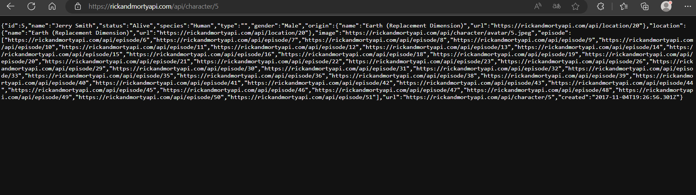

# MMMDE4IN19-23-DHANE-Amine
Repository for Web Programming Project

## Exercise 0 : 
Has been done using the browser directly with the good id in the URL. Here is a proof :

<br>



# Project Website

This is a web application built using Express.js. It provides functionality for managing students and includes basic authentication.

## Prerequisites

- Node.js
- Express.js

## Getting Started

1. Clone the repository:

   ```bash
   git clone https://github.com/EPF-MDE/MMMDE4IN19-23-DHANE-Amine.git

2. Install the dependencies:

    ```bash
    npm install

3. Start the server:

    ```bash
    node app.js # or "npm run dev"

4. Access the application in your browser at http://localhost:3000.

<br><hr style="background-color:blue"><br>

# Functionality
## Pages
  #
   * ## Home Page (/) :
     * Displays a welcome message.
   
   * ## Students Page (/students) :
     * Displays a list of students.
     * Allows creating new students.
   
   * ## Create Student Page (/students/create) :
     * Provides a form to create a new student.

   * ## Student Details Page (/students/:id) :
     * Displays details of a specific student.
     * Allows updating the student's information.

   * ## Contact Page (/contact) :
     * Provides contact information.

   * ## Games :
     * ### Checkers (/games/checkers) :
       * Play the checkers game.
     * ### Tic-Tac-Toe (/games/tictactoe) :
       * Play the tic-tac-toe game.

<br><hr style="background-color:blue"><br>

# API Endpoints

* ## /api/students:
  * GET: Retrieves a list of students.
  * POST: Creates a new student.
  
* ## /api/login:
  * POST: Logs in the user and sets an authentication token cookie.

<br><hr style="background-color:blue"><br>

# Authentication
Basic authentication is implemented using the express-basic-auth middleware.
User credentials are stored in a CSV file (users.csv).
Passwords are hashed using bcrypt for security.

<br><hr style="background-color:blue"><br>

# Data Files

* ## name_school.csv : Contains student data (id, name, school).
* ## users.csv: Contains user data (username, password).

<br><hr style="background-color:blue"><br>

# Thank you !
